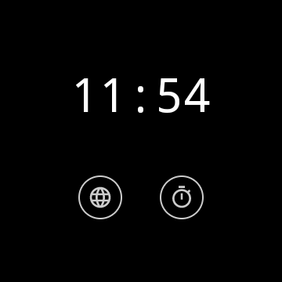
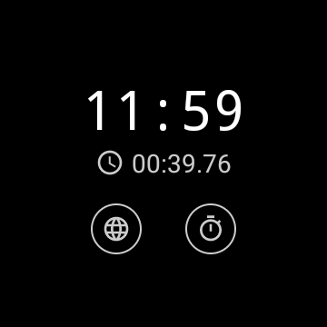
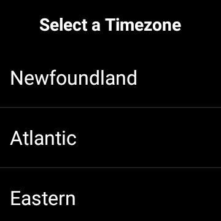
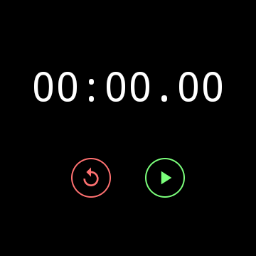
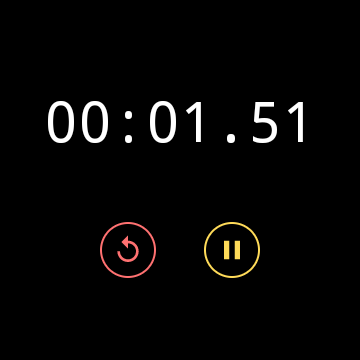

# Stopwatch App for WearOS
Graem Sheppard

## About
Simple app for displaying the time in a specified timezone on a smartwatch with a built in stopwatch. 

## Main Screen
- Current time displayed in selected timezone
- Buttons for selecting the timezone or opening the stopwatch
- Stopwatch elapsed time (if it is running)

## Timezone Screen
- List of Canadian timezones

## Stopwatch Screen
- Elapsed time displayed in minues, seconds, and milliseconds
- Start/Stop button and reset button

